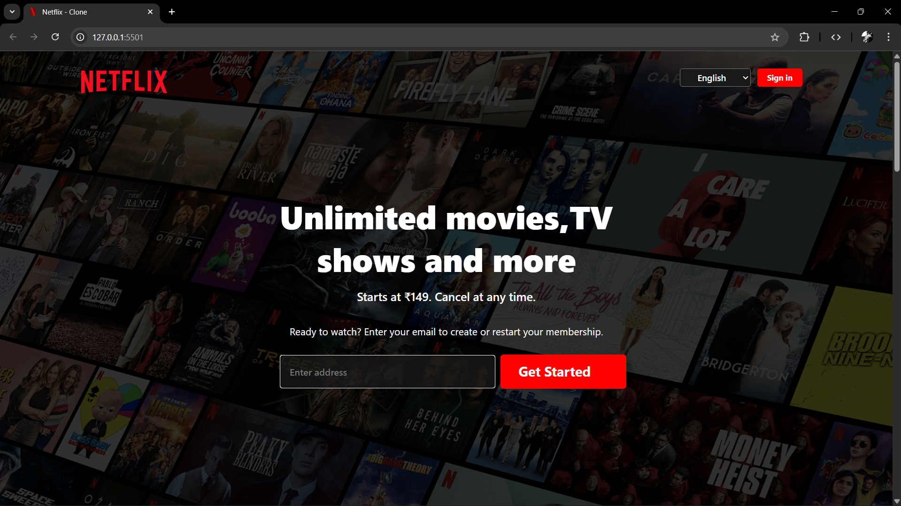
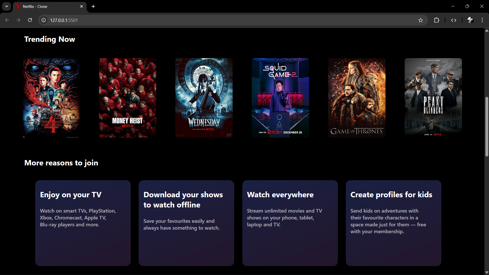
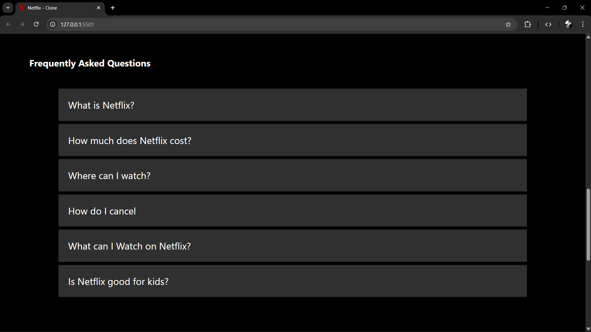
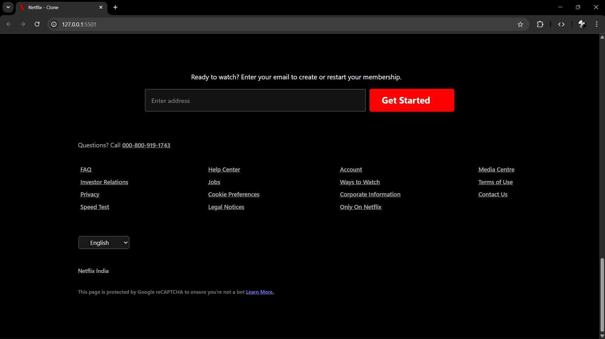
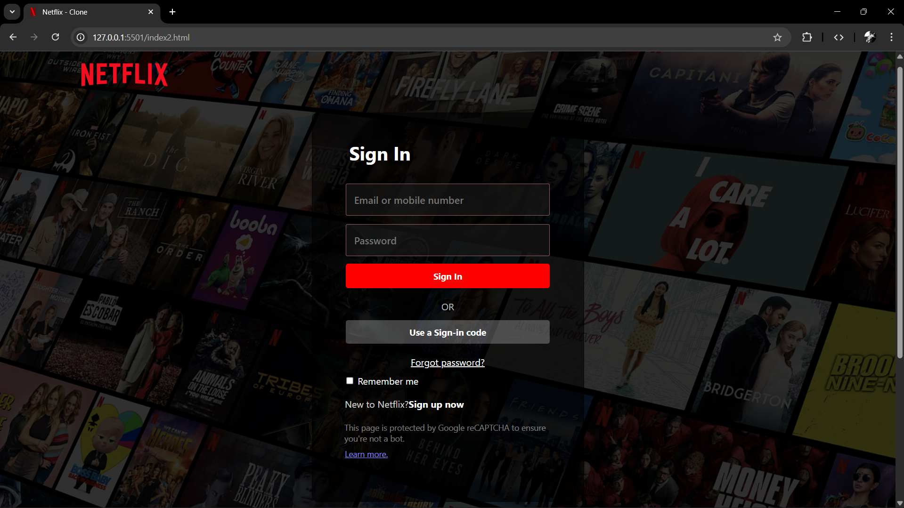

# 🎬 Netflix Clone

This project is a simple **Netflix Homepage UI Clone** built using **HTML and CSS**.  
It recreates the modern and clean design of Netflix’s homepage, focusing on layout and styling.

---

## 🧩 Features
## ✅ Landing Page
- Netflix-style hero section with title, description, and call-to-action buttons  
- Clean UI with dark theme and bold typography  
- Styled buttons with hover effects  
- Responsive layout for desktop screens  
- Image assets for banners, thumbnails, and backgrounds  
- Well-structured HTML and CSS codebase  

## ✅ Sign-in Page
- Clean sign-in UI similar to Netflix
- Email & password fields
- Sign-in button & sign-in using code
- "Forgot password" option
- "Remember me" checkbox
---

## 🛠️ Technologies Used

- **HTML5** — Page structure  
- **CSS3** — Styling, layout, hover effects  

---

## 📸 Preview

